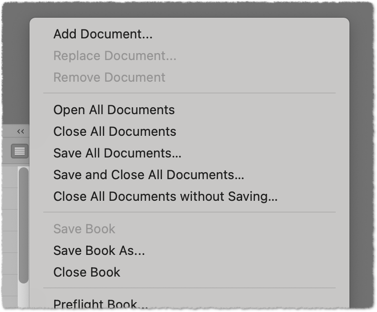

# BookDocs-OpenSaveCloseAll

A script for Adobe InDesign that adds menu items to the book panel menu for opening/saving/closing *all* documents of the active book. This is a startup script (place it in the Startup Scripts folder inside your user scripts folder).

The script is based on the script “BookOpenAll“, downloaded from [here](https://creativepro.com/add-missing-options-to-the-book-menu/) (Theunis De Jong, 2012).

Other variants and related discussion on *hilfdirselbst*: [1](https://www.hilfdirselbst.ch/gforum/gforum.cgi?post=555008#555008), [2](https://indesign.hilfdirselbst.ch/2017/01/alle-dateien-im-indesign-buch-offnen.html).

This script has been tested with InDesign 19.x (2024) on macOS. Since I recently added some features, there might be bugs… (but it doesn't seem so). 

Use this script at your own risk. Make sure it works properly with your setup before using it with production documents!

## Improvements over the original version: 

- More functionality: Open, Close, Save All
- Confirmation for potentially dangerous actions
- “Close All” only closes book documents that are actually open

Details see below.

### More functionality

The script adds these menu items to the book panel menu:

- Open All Documents
- Close All Documents
- Save All Documents…
- Save and Close All Documents…
- Close All Documents without Saving…



“Open All Documents” has two extra features:

- Hold down Option/Alt to silence any dialogs during opening (UserInteractionLevels.NEVER_INTERACT).
- Hold down Shift to open without showing windows (this might be useful to speed up certain book-wide operations, like synching or updating, without having window/tab clutter; or just to “preload” documents, so that the window builds instantly when you double-click the book document later).


### Confirmations

All functions where the menu item ends in an ellipsis bring up a confirmation dialog (i.e. all actions that enforce “All”). I prefer it this way, because it is easy to misclick a menu item, and accidentally closing all book documents without saving (or sometimes also with saving all) is not a nice experience.

To be extra safe, the confirmation dialog also shows the name of the book that InDesign considers to be the active book, so it should be less likely that you accidentally close all docs of the wrong book.

### “Close All” closes only book documents that actually are open

In the original version of the script, book documents are closed using a somewhat odd procedure:

```JavaScript
app.open (app.activeBook.bookContents[i].fullName, false).close(SaveOptions.YES)
```

This means that to close a document, the script first opens it and then immediately closes it. If a document is actually open, this doesn't matter, but if you have, say, a book with 15 documents, 5 of which are open, the script will also open the 10 unopened documents (without showing a window), only to close them immediately.

I found it more straightforward to just iterate through the *open* documents, test if a document belongs to the active book, and close it if true. The test can be done with – IMO – sufficient reliability by comparing the `fullName` string (path + filename) of the open document with that of the members of the active book.

Besides being a bit faster, this also ensures that the modification dates of the files are only changed if you have actually modified the document.

So far, it works like a charm, and I'm still wondering why the original script resorted to this open-all-and-close-again strategy. But maybe I'm missing something (if so, please let me know).


